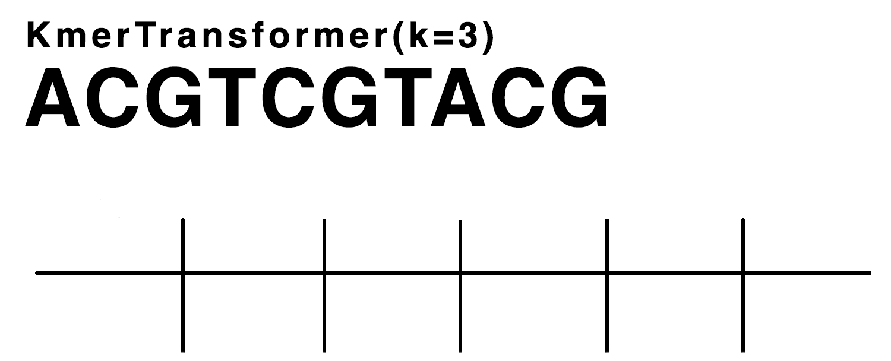
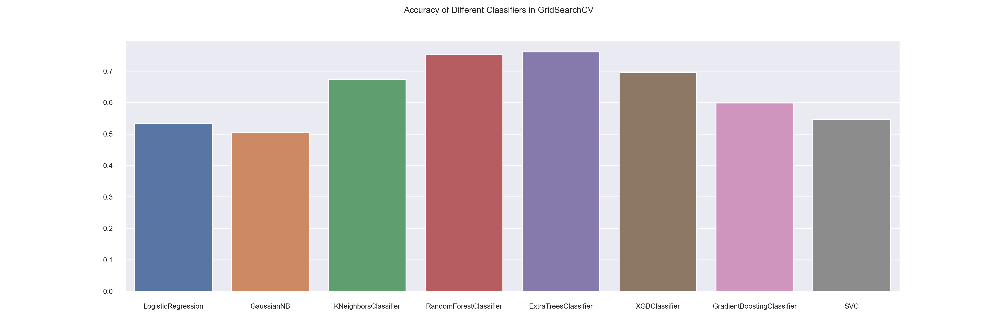
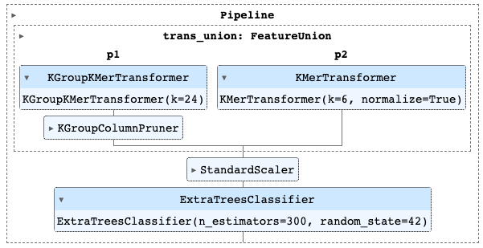

# Species prediction from DNA sequence data
Demonstration of machine learning classification methods using DNA sequence data

# Project Introduction

For this project, my main focus is going to be on demonstrating classification models and methods. To pick an example, I decided to research DNA sequencing analysis, because I thought it would be interesting, and the data that is available publicly is astonishingly immense.

DNA is found in the cells of every living thing on Earth. Scientists can study the DNA of organisms to understand more about the function of an organism or analyze the DNA to determine if they have found a new species.

DNA classification has many uses - from species identification to differentiation, research can provide insights on how different one species is from another, or how one species evolved. Genetic sequence analysis can identify the differences in genes, insertions, and deletions within subsets of the DNA, or identify the change in phenotypes from species to species. Analysis of the differences in the sequences from different species can tell us a lot about the differences between species, but also how similar all organisms are.

Through optimization of the modeling in DNA sequence analysis, genomic researchers can make more accurate and faster results for classifying and differentiating species from DNA samples.

### Hypothesis:

What if I could take DNA information from a certain genome and compare it to other genomes? Would there be a signal in the noise? Of course, there would be and there is, but I started with a null hypothesis in question: Could these genomes be unrelated or random sequences next when compared?

Alternatively, I hope to find the pattern of similarity, and I hope that will be measured in the metrics of my model. I am no biologist, but as a data scientist, I will be viewing this problem as one of loss - observing the similarities between genomes and explaining the variance between them by predicting their respective class. From a technical point of view, this project will use machine learning methods to analyze and classify the DNA sequences from different species. The results of this model will be used to predict the species of a given set of classes based on the genetic sequence alone. This project will focus primarily on the mathematical differences between sequences in genetic code, rather than any special genetic analysis of genes and phenotypes between species. I am interested in the problem of how similar or different two species may be from one other, from a generalized and statistical point of view.

# What is DNA?

DNA, or deoxyribonucleic acid, is a molecule that contains the inherited code used by cells in an organism to generate proteins. It is found in the nucleus of cells. DNA consists of four bases: adenine or A, cytosine or C, guanine or G, and thymine or T. Each strand of DNA is composed of two strands that are held together by a sugar-based structure in the shape of a double helix. Each base is connected to the opposite strand by its complementary base: A always connects to T, C always connects to G, G always connects to C, and T always connects to A. This means that each complementary strand of DNA is like a reflection of the other. When DNA is sequenced into a string composed of the four bases, only one string has been cataloged in the data I am reading, without its complement.

Through complicated biological and molecular processes, DNA replicates or creates copies of itself known as mRNA. mRNA strands are short segmented copies of the DNA that can recombine with other segments of mRNA and in turn create combinations that are code for creating proteins. Different combinations create different proteins and these proteins are then used throughout the cell and the organism. DNA acts like computer code for creating the proteins like a program and thus why it is referred to as genetic code or the building blocks of life. Subsets of DNA strands can be identified for creating specific proteins and these are known as genes.

The DNA in every cell is coiled up tightly together, and although it takes up a microscopic amount of space, it is very long. If you carefully unraveled an entire strand of Human DNA it would be about 1.8 meters long and contains 3 billion base pairs i.e. combinations of A, C, G, and T.

Advances in technology have allowed scientists to sequence microscopic data within a small margin of error. The total number of genes in one species is known as that species' genome. The Human Genome Project, ongoing from 1990 to completion in 2003, mapped the entire human genome across about 20,000 non-overlapping samples. Today, there are many different species genomes mapped and publicly available to download for research and analysis.

# Common DNA sequence feature engineering methods

Genomics is a broad field of study that classifies, analyzes, and maps genomes of organisms. Within genomic data science, there are many ways that machine learning can be used to analyse sequence data.

If taking a strand of DNA as input, a string may appear as a combination of A, C, G, and T character, such as:
'ATGAAGAAGGTAACTGCAGAGGCTATTTCCTGGAAT...'

This strand may identify a specific gene in the selected genome and/or may be a variable length. There are few common ways that genomic data scientists encode this sequence as features in a model.

One way is to one-hot encode each character in the sequence. One-hot encoding creates 4 features for every character where A may equal [1,0,0,0] and C may equal [0,1,0,0] and so on. Those 4 features are created for every character in the sequence.

Another common method to use, especially if the length of the sequence is variable, is called minhash. [Minhashing](https://en.wikipedia.org/wiki/MinHash) is a computer science method of comparing the similarity between two sets. In bioinformatics, minhashing can be used to transform a sequence into a frequency dictionary of k-length substrings called [k-mers](https://en.wikipedia.org/wiki/K-mer) of a given integer k. First, columns are created for all possible k-mers of genetic code and then populated on every index in the string. For example a string 'gtatca' could be converted in k-mer of k=2 by extracting all substrings of length 2 along the string: from 'gtatca' would populate 'gt', 'ta', 'at', 'tc', and 'ca' columns.

In this project, I will only use the minhashing method to create all of our features used in the model.

# Preprocessing

In this project, I used two forms of preprocessing the sequences for modeling. For both I used custom transformer classes that implement minhashing to create frequency dictionaries for each row. 

The first method, from the KMerTransformer class, creates columns for every k-mer permutations of all possible permutations and updates the column with thenumber of occurences of that k-mer in the sequence.

Below is an animation that illustrates this method for k=3.

This method will not only encode the combination of each k-mer count, but also the sequence order. This leads to some colinearity in the features, but abstractly encodes the sequence of each DNA string into the row data.

The second method, from the KGroupKmerTransformer class, uses a similiar method but does not encode the sequence. Similar to the KMerTransformer, this transformer will create frequency dictionaries for each row of data. Unlike the KMerTransformer, it will pool all the A's, C's, G's, and T's counts' instead of their unique sequences.

In other words, if we have a sequence like 'AAGTCGAGT' we will have 3 A's, 1 C, 3 G's, and 2 T's. So the sequence will populate a column named: 'A2C1G3T2'. Similiarly, a sequence like 'GTGAAACTG' would also populate the same column. This means that we will create many times less columns for the same k. Thus, we will increase k significantly when we call the transformer.

# Modeling

After iterating through different models, I found that sci-kit learn's ExtraTreesClassifier was the best classifier for binary and multiclass classification of the DNA sequences. 

My final model combines the preprocessing techinques from the KMerTransformer and the KGroupKmerTransformer and concatenates their transformations, before sending the data through the classifier.

# Results

My final model achieved a 90% acccuracy on test data for classifying sequences between 5 genomes of DNA. Although there is room for improvement in the model, as well as trying out other classification methods (i.e. neural networks), I can reject my null hypothesis, and we can assume there are patterns of similiarity between the classes of the genomic data. Moreover, we are able to distinguish the patterns and variance and classify species from individual DNA sequences with high accuracy.
